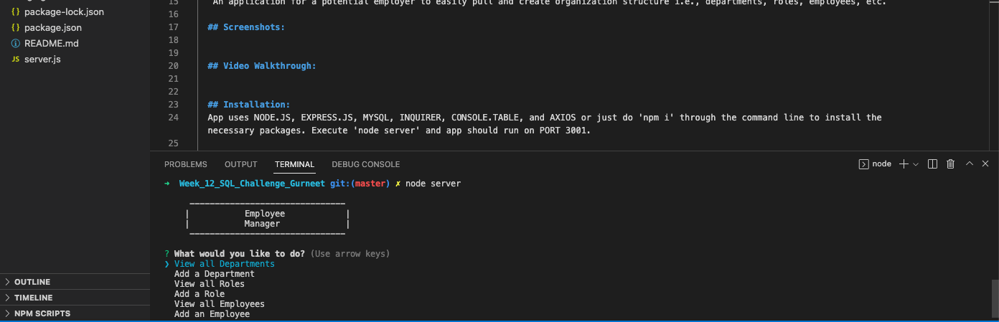

# Employee Tracker

  ## Licensing:
  

  ## Table of Contents 
  - [Description](#description)
  - [Installation](#installation)
  - [Usage](#usage)
  - [Contribution](#contribution)
  - [Testing](#testing)
  - [Additional Info](#additional-info)

  ## Description:
   An application for a potential employer to easily pull and create organization structure i.e., departments, roles, employees, etc.
  
  ## Screenshots:
  

  ## Video Walkthrough:
  

  ## Installation:
  App uses NODE.JS, EXPRESS.JS, MYSQL, INQUIRER, CONSOLE.TABLE, and AXIOS or just do 'npm i' through the command line to install the necessary packages. Execute 'node server' and app should run on PORT 3001.

  ## Usage:
  Just type node server and the application will start running. This should be used by anyone who would like to create and visulaize their organization structure.

  ## License:
  None

  ## Contribution:
  No contributions please.

  ## Testing:
  Tested thoroughly in develompment environment.
  
  ## Additional Info:
  - Github: [neetsabharwal](https://github.com/neetsabharwal)